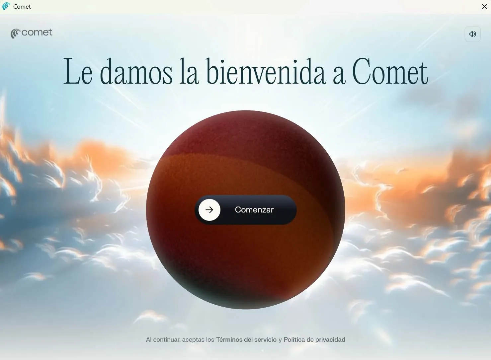
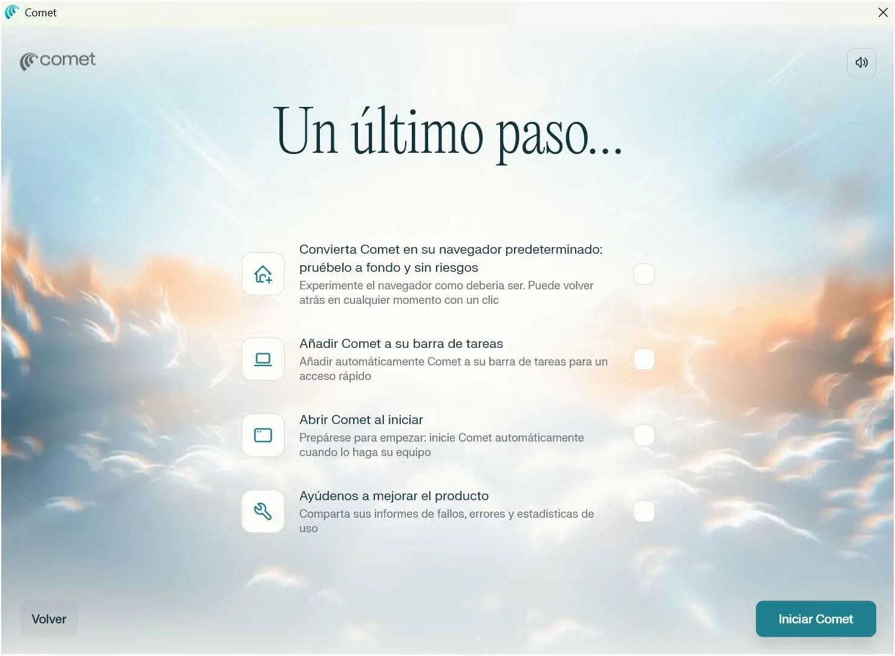

# Comet：Perplexity推出的免费AI浏览器，真的值得换吗？

---

如果你厌倦了Chrome的千篇一律，又不想折腾太复杂的新工具，Perplexity刚刚开放的Comet浏览器可能正好适合你。它基于Chromium内核，操作习惯和Chrome几乎一样，但内置了AI助手——能帮你总结网页、快速找信息，甚至直接在浏览器里和AI聊天。最重要的是，现在完全免费，Windows和macOS都能用。

---

## 从付费到免费：Comet向所有人开放

Perplexity在10月2日的官方公告里说得很直白：他们想让更多人用上"更好的互联网"。Comet最初只对付费订阅用户开放，现在彻底免费了。

我自己下载试了一遍，整个过程没什么门槛。去官网下载安装包，双击运行，几分钟就搞定。支持Windows 10/11和macOS 12及以上版本，移动端版本也在路上。

安装完会跳出一个简短的介绍视频，然后点"开始"就能用了。没有复杂的注册流程，也不强制你登录账号。

## 迁移数据？一键搞定

如果你担心换浏览器太麻烦，Comet有个很贴心的功能：直接导入其他浏览器的数据。

首次启动时，它会问你要不要从Chrome、Firefox、Edge或Opera导入书签、密码和浏览历史。我试了一下从Chrome导入，几秒钟就完成了，连扩展程序的设置都保留了。当然，你也可以跳过这一步，从零开始。

接下来还能选择浅色或深色模式，设置是否开机自启、是否设为默认浏览器等。这些选项都很常规，但至少给了你足够的自由度。

## 用起来和Chrome有多像？

打开Comet的第一感觉是：这不就是换了个皮肤的Chrome吗？

界面布局、设置菜单、甚至快捷键都和Chrome高度一致。如果你习惯了Chrome的操作逻辑，切换到Comet几乎没有学习成本。扩展程序也能正常安装，因为它本质上就是基于Chromium开发的。

但真正的区别在右上角那个"助手"按钮。点开后，会弹出一个AI聊天窗口。你可以直接问它问题，比如"这个页面讲了什么？"或者"帮我找一下关于路由器配置的教程"。

我试着在一个科技网站上问它"哪里有Wi-Fi设置教程"，它直接给出了几篇相关文章的链接，还附带了简短的说明。这比自己在页面里翻找快多了。

另一个实用功能是"总结当前页面"。如果你打开一篇长文章，点一下这个按钮，AI会生成一段摘要，帮你快速抓住重点。对于需要快速浏览大量信息的人来说，这个功能挺省时间。

👉 [想了解更多AI搜索工具的实际应用场景？点这里看看Perplexity如何改变信息获取方式](https://pplx.ai/ixkwood69619635)

## Comet和其他AI浏览器有什么不同？

市面上已经有不少带AI功能的浏览器了，比如Arc Max和Opera Neon。Comet的定位有点不一样。

Arc Max更侧重用GPT-3.5和Anthropic的模型来辅助浏览，Opera Neon则强调内容生成和社交互动。Comet的核心是Perplexity自己的对话式搜索引擎——它会实时给你上下文相关的答案和摘要，而不是单纯调用第三方AI模型。

简单说，如果你已经在用Perplexity的搜索服务，Comet就是把这套体验直接搬到了浏览器里。你不需要再开两个窗口，一个搜索一个浏览，所有操作都能在一个地方完成。

## 隐私问题：这是个需要权衡的点

不过，有一点需要提前说清楚：Comet会收集你的浏览数据。

虽然官方说AI查询是端到端加密的，但和Chrome一样，它会记录你的使用习惯来优化AI功能。如果你特别在意隐私，可能更适合用Brave或Tor这类专注隐私保护的浏览器。

Comet的安全性基本和Chrome持平，毕竟底层技术是一样的。但如果你不想让AI"学习"你的浏览行为，这款浏览器可能不是最佳选择。

## 常见问题

**Comet安全吗？**  
基于Chromium内核，安全机制和Chrome类似。AI查询采用端到端加密，但会收集使用数据来改进服务。

**能装Chrome扩展吗？**  
可以。所有兼容Chromium的扩展都能正常安装使用。

**可以自定义设置吗？**  
支持调整启动选项、隐私设置、外观主题等常规配置。

---

## 结语

Comet适合那些想尝试AI功能、但又不想彻底改变使用习惯的人。它没有激进的设计，也不会强迫你学新操作——就是在熟悉的Chrome体验上，加了一个随时能调用的AI助手。如果你本来就在用Perplexity搜索，现在有了Comet，整个工作流会更顺畅。👉 [想体验AI如何让浏览更高效？试试Perplexity的完整生态](https://pplx.ai/ixkwood69619635)
